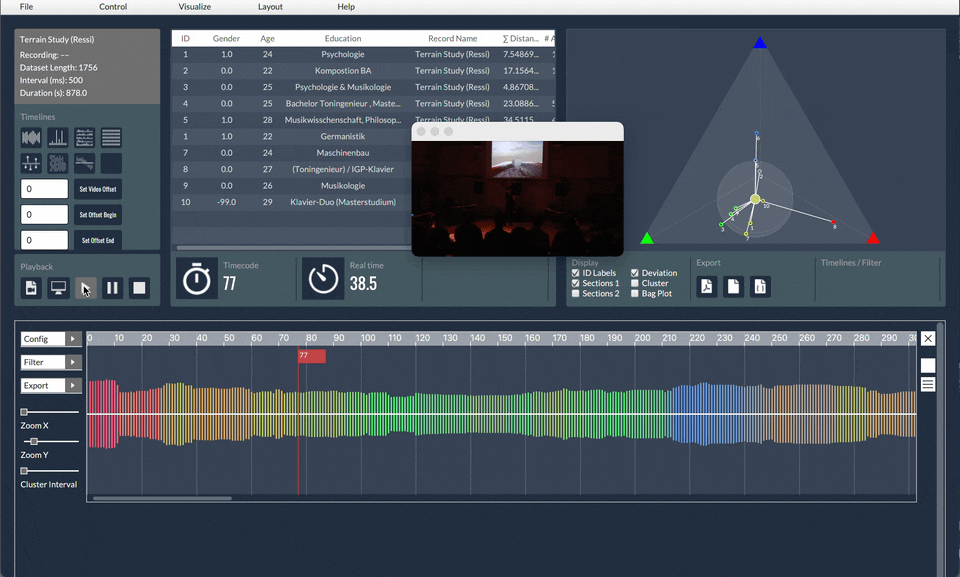
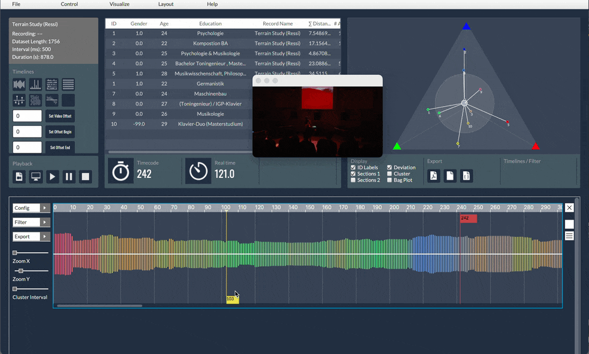

# MEDIS Analysis

Analysis application that allows for calculations and visualizations with audience response data. 
MEDIS is a further development of the [IRMA](https://github.com/asa-nerd/IRMA/tree/master) apparatus that was first used in the GAPPP project. 

### Dependecies:

With version 0.9 MEDIS is developed using JavaFX and the IntelliJ IDEA. 
Liberica JDK (17.0.4 V2) provides JavaFX integration: https://bell-sw.com/libericajdk/
JavaFX (which is part of the JDK if Liberica is used): https://openjfx.io
json-simple: https://github.com/fangyidong/json-simple
javaGeom: https://sourceforge.net/projects/geom-java/files/

Playback of video alongside visualizations of time series data.

Defining sections of the time series for calculations and visualizations.